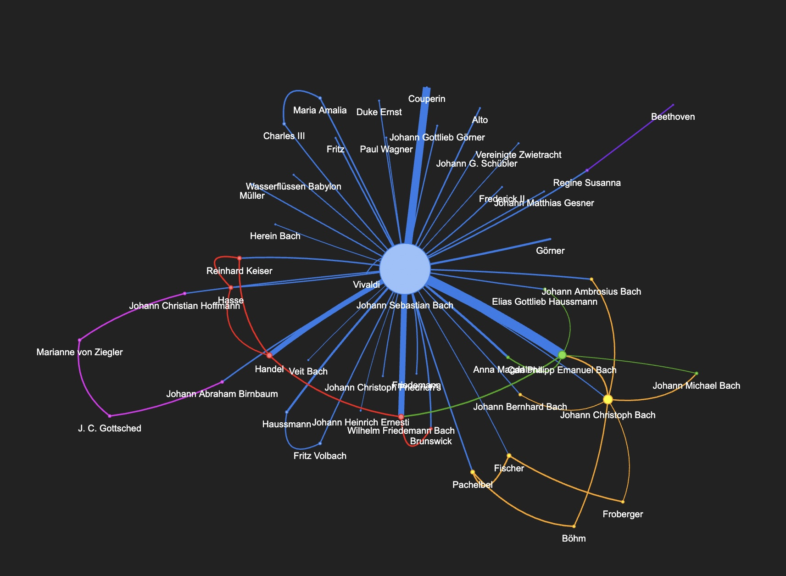

# 生成AI時代マーケティング部門エンジニアとしてのNLP/LLM自習

NLP勉強しておかないと、生成AIの使い所を正しく判断出来ない。NLP知らずして生成AI語るのは愚か。Excelだけでデータ分析で良い？AI使わないと時代遅れ。だからPython使わないと！

## 自習のためのNotebook

### replace(), re.sub(), split(), join()

前処理で多用するので勉強しておく。

### pandas

仕事ではCRM/SFA系SaaSからエキスポートされたcsv形式データのデータ分析にpandasを良く使う。pandasは、NLPの処理結果をテーブルとして表現したりチャート化するときにも使われる。

CRM/SFAの限界を感じる。いろいろな意味で、SaaSだと非構造化データをうまく扱えない。技術的な理由、秘密区分上の理由、組織構造上の理由など。NLPでは、部署内からはアクセス可能な非構造化データを構造化してテーブルとして表現できるところが面白い。なので、マーケティング部門エンジニアは、NLPを勉強しておく必要あり。

### NLTK

最初の第１歩。PythonでNLP何たるかを知るためNLTKからNLP始めた。しかし、後で、今はAI使ったNLPが主流だと知った。仕事でNLTK使う機会はないが、NLPの勉強始める時はNLTKから始めた方が良い。

- [NLTK Basics](NLTK_Basics.ipynb)

### spaCy

パシフィコ横浜で開催されたEdgeTech+2023展示会でO'Reillyの[実践 自然言語処理](https://www.oreilly.co.jp/books/9784873119724/)を購入。展示会で買うと20%ディスカウントで良い。この本でspaCyの存在を知った。NLP実践のための良書。この本をとかっかりにNLPの勉強を本格的に開始。spaCy、マーケティングの仕事で結構使える。APIがシンプルで良い。認識精度上げたければTransformerモデル使うことも出来る。

spaCyはAPIが綺麗で使いやすい。spaCyの開発者はドイツのベルリン在住者が多い。ドイツらしいシステマティックなAPI？

25年前、私もドイツのベルリンに住んていた。ベルリンってドイツ北東部に位置するので、バッハの音楽を沢山聴いた。プロテスタント教会で聴いたオルガン音楽やクリスマスオラトリオ。Project Gutenbergよりバッハの本からspaCyによるNLPでバッハの人脈図をつくってみた。[Thu Vu](https://www.youtube.com/@Thuvu5)さんのYouTube上動画で勉強しながらつくった。本から人脈図がつくれてしまうなんて、The Vuさんへ感動！こういうのって、マーケティング部門の仕事へすごく使える。



- [spaCyでNLPインスタンス生成](spaCy/spacy.ipynb)
- [spaCy and networkx](spaCy/spaCy_networkx.ipynb)
- [キーフレーズ抽出](spaCy/key_phrases.ipynb)
- [感情分析](spaCy/sentiment.ipynb)

### Transformers

LLMの勉強しようと書籍店で"大規模言語モデル入門"を購入。NLPの知識なく、いきなりこれを理解するのは無理。O'Reillyの"実践 自然言語処理"で勉強してからこの本を読む。これまで実践してきた音声処理や画像処理系AI(DNN/CNN)の経験が役にたちそう。AIって何？学習って何？学習ってすごく面倒で大変！その辺、十分に経験してきたので。

学習済み感情分析モデルがHugging Faceのサイトに沢山あり。マーケティング部門では感情分析がかなり重要。

- [ChatGPTへネガポジコメント生成させChatGPTへネガポジ分析させる。精度がよくないので、他の手法でネガポジ分析させるため、ネガポジコメント文章を出力](./transformers/positive_negative.ipynb)
- [Tranformersでネガポジ分析など基本処理](transformers/TransformersBasics.ipynb)

### Tools

マーケティング部門にある非構造化データといえば、エクセルの顧客コメント資料、パワポやPDFの資料、そして、画像や動画コンテンツ。これらをAIで分析すれば有用な何かが得られるはず。

- [PowerPointとPDFからデータ抽出](tools/ppt_pdf.ipynb)

---

### spaCy

NLP開発環境 & NLPライブラリ

https://spacy.io/

### Transformers

NLP開発環境 & NLPライブラリ

https://huggingface.co/docs/transformers

### GiNZA

spaCy及びTransformers上で動作する日本語NLP。日本語TokenizerであるSudachiPy採用。

https://megagonlabs.github.io/ginza/

### ChatGPT

数ヶ月使ってみて、生成や要約は得意だけど分類は苦手そう。毎度、出力される結果が異なり、期待しない結果が出力される時も多く、私にとっては使いにくい。ChatGPTはアシスタントとして使うと良い。機械的な自然言語処理には他の手法、出力される結果に一貫性あるものを適用したい。

### ソーシャルネットワーク

spaCyのNLP結果をソーシャルグラフに乗せたい。マーケティングでは、誰が他の誰と繋がっているか、誰が何と繋がっているかが重要。グラフDBといえばneo4jだが、何か軽量動作するものはないか？昔使ったPythonのnetworkxをとりあえず使ってみて感触を掴む。

参考
- [Network of The Witcher | Relationship Extraction & Network Analysis with Spacy & NetworkX](https://youtu.be/fAHkJ_Dhr50)
- [How to create an Undirected Graph using Python](https://youtu.be/rldKl1CNx-A)
  
## 購入した教科書

NLP教科書
- [実践 自然言語処理](https://www.oreilly.co.jp/books/9784873119724/)
-- [サンプルコード](https://github.com/oreilly-japan/practical-nlp-ja)

日本語LLMの参考として
- [大規模言語モデル入門](https://gihyo.jp/book/2023/978-4-297-13633-8)

## 学習/実行環境

- MacBook Air 16GBRAMモデル
- Google Colab

## Transformersのモデル保存場所

```
/Users/<username>/.cache/huggingface/hub
```

モデルのサイズが大きいので、用済み後は必要に応じ削除する。

## その他参考

- [Natural Language Processing With Python's NLTK Package](https://realpython.com/nltk-nlp-python/#getting-started-with-pythons-nltk)
- [Python による日本語自然言語処理](https://www.nltk.org/book-jp/ch12.html)
- [感情分析のやり方が7割わかるようになる記事（初心者向け）（ソースコードあり）（GiNZA）](https://qiita.com/Mizuiro__sakura/items/94efccb5ba12046d17b0)
- [How should I preprocess text for spaCy?](https://github.com/explosion/spaCy/discussions/10243)
