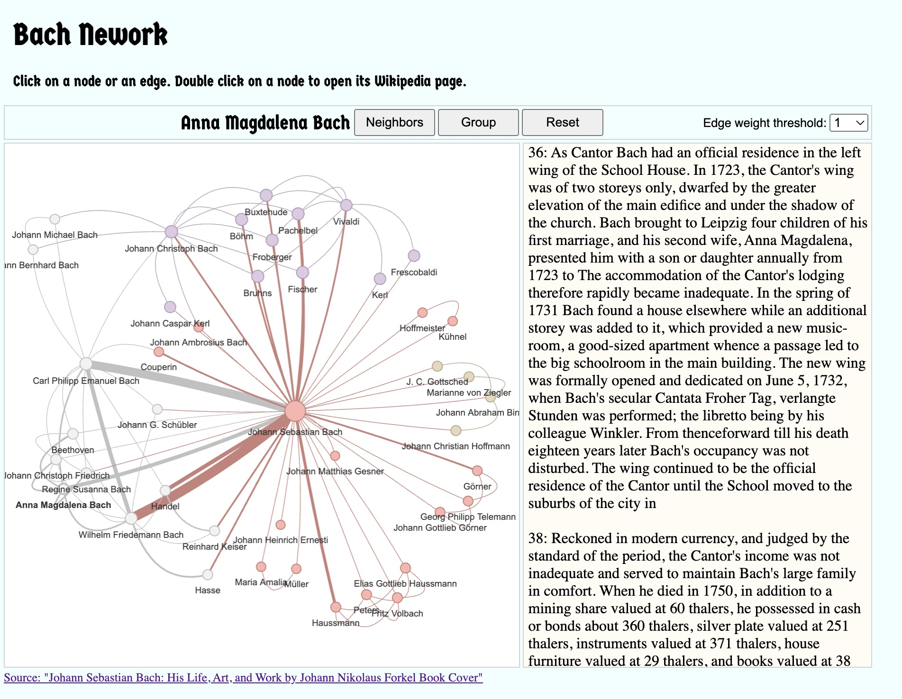
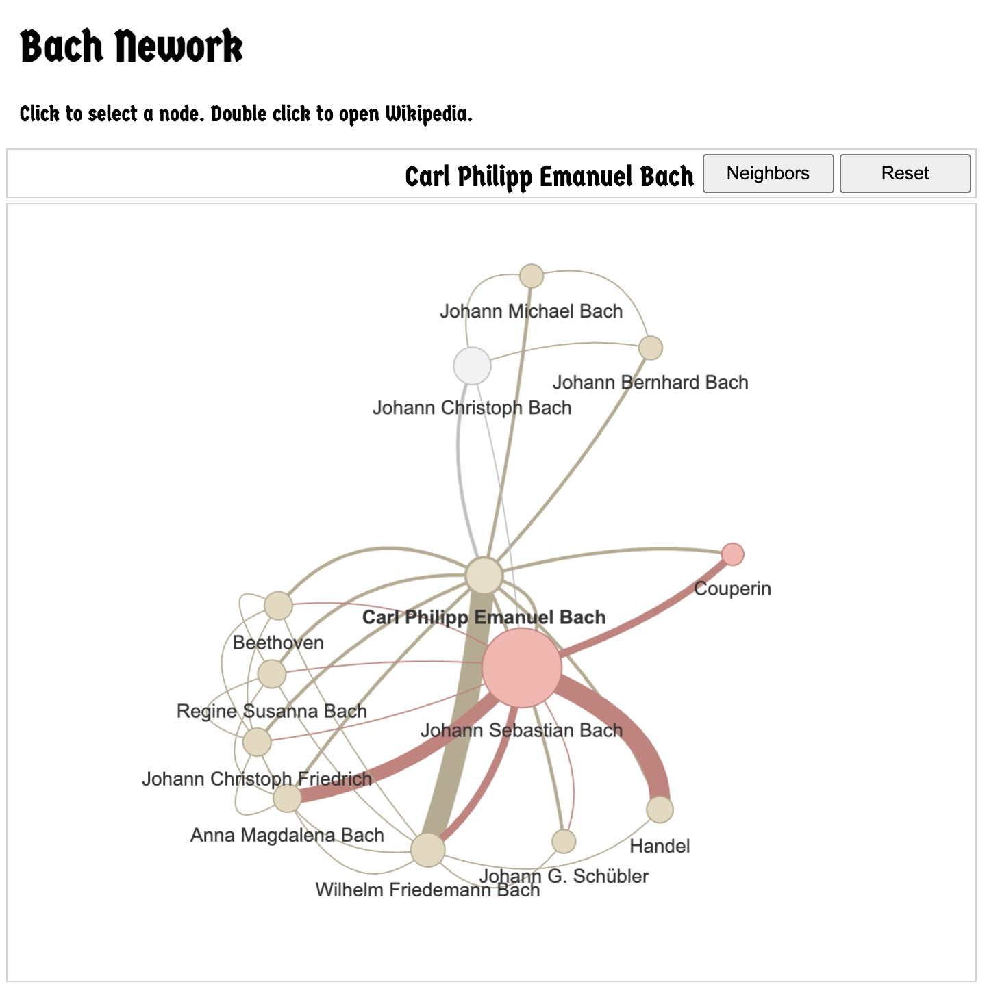

# マーケティング部門エンジニアとしてのNLP(自然言語処理)自習

<h6>注）本プロジェクトは、自然言語処理の経験がなかった私個人が、週末夜間に自己研鑽として進める自習用プロジェクト。2023年10月下旬より開始。</h6>

<a href="https://araobp.github.io/learning-nlp/bach_network.html"></a>

<h6>モチベーション維持：Bach人脈図生成してみたら、<a href="http://shop.zen-on.co.jp/p/911278">主よ，人の望みの喜びよ</a>の楽譜を買ってピアノを弾き始めた。</h6>

## ここで自習するワークフロー

```
企業におけるデータサイエンスはドメイン固有の知識/経験の上で成り立っている。
マーケティング部門においては、非構造化データのデータ利活用が進んでいないのが最大の課題。
ここでは、自然言語処理(NLP)やグラフ理論を適用した非構造化データのデータ利活用を考える。

....... Jupyter Notebook上でドメイン固有の各種処理 ......   ................. ブラウザ上で処理 ..........................
        ......... spaCy ............   .. networkx ..  ......... graphology.js ........   ....... vis.js .........
[原文]=>[トークン化]=>[固有表現認識(NER)]=>[ネットワーク化]=>[インメモリグラフDB]=>[サブグラフ抽出]=>[可視化]=>[Entity Linking]
任意のドキュメント
Excel/CSV         
Powerpoint/PDF
画像
```

たぶん、こういうのにLLMのユーザインタフェースを加えたものが、Gatner Hype Cycle 2023 Emerging Technologies の黎明期に位置付けられたグラフデータサイエンスかも。。。確率論で回答を生成するのではなく、ナレッジグラフから回答生成する説明可能なAI。

元ネットワークエンジニアの私としては、むしろ、SQLデータベースよりもネットワークグラフでデータを扱うのが自然。SDN(Software Defined Networking)では、Cassandra上にネットワークグラフのデータを乗せたりして、クラウド分散型のNoSQLデータベース使っていた。

なお、ナレッジベースとしてPostgreSQLや各種オブジェクトストレージ、グラフDBとして[neo4j](https://neo4j.com/)を使いたいが、ここでは、敢えて使わず、networkxやgraphology.jsで代用。その心は、ある程度のプロトタイピングでその効果を実証しないと、お金は付いてこないということ。最初はゼロ円で開発を始める。全てローカルPC上、かつデータベースレスで動作させる。ユーザ向けウエブインタフェースもReact等のフレームワークを使わず、Vanilla JSで作る。初期のプロトタイピングでは、コストを最小化するため、全てをローカル動作に集約させる。

## Jupyter Notebook

### pandas

仕事ではCRM/SFA系SaaSからエキスポートされたcsv形式データのデータ分析にpandasを良く使う。pandasは、NLPの処理結果をテーブルとして表現したりチャート化するときにも使われる。

- [Titanicデータセット](etc/Titanic.ipynb)

### NLTK

NLP自習の第１歩、NLP何たるかを知るためNLTKからNLP始めた。しかし、後で、今はAI使ったNLPが主流だと知った。仕事でNLTK使う機会はないが、NLPの勉強始める時はNLTKから始めた方が良い。

- [NLTK Basics](NLTK_Basics.ipynb)

### spaCy

パシフィコ横浜で開催されたEdgeTech+2023展示会でO'Reillyの[実践 自然言語処理](https://www.oreilly.co.jp/books/9784873119724/)を購入。展示会で買うと20%ディスカウントで良い。この本でspaCyの存在を知った。NLP実践のための良書。この本をとかっかりにNLPの勉強を本格的に開始。spaCy、マーケティングの仕事で結構使える。APIがシンプルで良い。認識精度上げたければTransformerモデル使うことも出来る。

spaCyはAPIが綺麗で使いやすい。spaCyの開発者はドイツのベルリン在住者が多い。ドイツらしいシステマティックなAPI？

25年前、私もドイツのベルリンに住んていた。ベルリンってドイツ北東部に位置するので、バッハの音楽を沢山聴いた。プロテスタント教会で聴いたオルガン音楽やクリスマスオラトリオ。Project Gutenbergより入手した[バッハの本](https://www.gutenberg.org/cache/epub/35041/pg35041-images.html)から、spaCyによるNLPでバッハの人脈図をつくってみた。[Thu Vu](https://www.youtube.com/@Thuvu5)さんのYouTube上動画を参考にした。

ある程度慣れたら、このコースで網羅的に学習する：[Advanced NLP with spaCy](https://course.spacy.io/en)。add_extension(), nlp.pipe()など、NLP実践時には必須。

spaCyを実践で使ってみると、NERがとても使えることが分かった。しかし、うまく認識してくれない固有表現も多い。役職名や会社に固有な製品名など。その辺を改善するには、spaCyを再学習させる必要あり。ただし、自然言語処理は８０％の精度と言っている人たちが多い。状況によっては、辞書とPhraseMatcherで固有表現抽出の方が精度高くて良いかも。その場合、辞書の定期的なメンテナンスが重要になる。再学習のコストと辞書メンテナンスのコストを天秤にかけて、どちらが良いか考える必要あり。

- [spaCyでNLPインスタンス生成](spaCy/spacy.ipynb)
- [キーフレーズ抽出](spaCy/key_phrases.ipynb)
- [感情分析](spaCy/sentiment.ipynb)
- [何故regexで国名抽出するときにNERで前処理する必要があるか？](spaCy/NER_with_regex.ipynb)
- [spaCy and networkx](spaCy/spaCy_networkx.ipynb) ... 最後に"bach_network.html"向けJavaScript出力。（注）Bach networkはスライディングウィンドウのNERでPERSON抽出しただけで、センテンスベースの関係抽出が出来ていない。
- [spaCy and networkx2](spaCy/spaCy_networkx2.ipynb) ... こちらでは、名前のペアをセンテンスから抽出する方法を採用。スライディングウィンドウで抽出する方法と大差ない結果となったが、こちらの方では PachelbelとJohann Christophの関係等を抽出出来ていない。

以下、バッハの本にも書かれている有名なくだり：

The most renowned Clavier composers of that day were Froberger,50 Fischer,51 Johann Caspar Kerl,52 Pachelbel,53 Buxtehude,54 Bruhns,55 [pg 11]and Böhm.56 Johann Christoph possessed a book containing several pieces by these masters, and Bach begged earnestly for it, but without effect. Refusal increasing his determination, he laid his plans to get the book without his brother's knowledge. It was kept on a book-shelf which had a latticed front. Bach's hands were small. Inserting them, he got hold of the book, rolled it up, and drew it out. As he was not allowed a candle, he could only copy it on moonlight nights, and it was six months before he finished his heavy task. As soon as it was completed he looked forward to using in secret a treasure won by so much labour. But his brother found the copy and took it from him without pity, nor did Bach recover it until his brother's death soon after.

この文章を見る限り、本当は以下のようなネットワークでなければならない。上の二つの手法、両方とも完全に正確ではない。

```
Froberger ---------------+---------+--------- Johann Christoph Bach ------- Johann Sebastian Bach
                         |         |                                                 |
Fischer -----------------+         +-------------------------------------------------+
                         |
Johann Caspar Kerl ------+
                         |
Pachelbel ---------------+
                         |
Buxtehude ---------------+
                         |
Bruhns ------------------+
                         |
Böhm --------------------+
```

正確に関係抽出するにはどうしたら良いのか？私にとって、今後の課題。名前が列挙されている場合には、それをノードのグループと捉え、少し離れて記述される名前(ノード)とエッジで結ぶ方が良いのかもしれない。
- パラグラウ内でスライディングウィンドウをかけてNamed Entity抽出。
- センテンス内でNamed Entityが列挙された場合、それをグループと捉える。グループ内のNamed Enitity間はエッジで結ばない。
- そのグループ内の個々のNamed Entityを、少し離れたNamed Entityとエッジで結ぶ。

上記手法、パワポ資料へNERかけてネットワークつくるときにも使えそう。スライドのタイトルとテキストボックス内のNamed Entity群をエッジで結ぶ。しかし、それには、NERに向いたパワポ資料作成が求められる。

ちなみに、上記ブクステフーデはオルガン演奏の名手で、リューベックの教会でオルガニストを務めた人物。バッハはリューベックまで聴きに行った。それを記念した石碑が教会内にある。私も、それを見に、リューベックまで何度か行った。そういえばリューベックに有名なお菓子[Marzipan](https://en.wikipedia.org/wiki/Marzipan)があって、それを日本に買って帰った。日本人の口には合わなかたが。。。と頭の中で連想してしまう。これが、人間の脳内にあるナレッジグラフ。

```
            日本人
              | 口に合わない
　　　　　　Marzipan
              |
      +- リューベック -+
      |              |
      |              |
ブクステフーデ ------ バッハ
```

### Transformers

LLMの勉強しようと書籍店で"大規模言語モデル入門"を購入。NLPの知識なく、いきなりこれを理解するのは無理。O'Reillyの"実践 自然言語処理"で勉強してからこの本を読む。これまで実践してきた音声処理や画像処理系AI(DNN/CNN)の経験が役にたちそう。AIって何？学習って何？学習ってすごく面倒で大変！その辺、十分に経験してきたので。

学習済み感情分析モデルがHugging Faceのサイトに沢山あり。マーケティング部門では感情分析がかなり重要。

- [ChatGPTへネガポジコメント生成させChatGPTへネガポジ分析させる。精度がよくないので、他の手法でネガポジ分析させるため、ネガポジコメント文章を出力](./transformers/positive_negative.ipynb)
- [Tranformersでネガポジ分析など基本処理](transformers/TransformersBasics.ipynb)

## ブラウザインタフェース

自分がつくったものを、他のメンバーへ使ってもらわないと意味がない。プログラミング知識ない、Python触ったことない、それを前提に考えると、ブラウザから操作できるインタエースを提供する必要ある。

### vis.js/graphology.js

networkxだとブラウザ上での表現ができないので、networkxのデータを[vis.js](https://visjs.org/)へ取り込む必要あり。[pyvis](https://pyvis.readthedocs.io/en/latest/)もあるがvis.jsの機能をフルサポートしておらず、私にとっては都合が悪い。ここでは、pyvisとは逆で、vis.jsを埋め込んだHTML5からnetworx上のデータを取り込むアプローチを探る。JavaScriptのスクリプトを書けば実現できる。 

しかし、vis.jsは可視化はできるがグラフ理論実装されておらず、実践上では不都合が出てきた。ブラウザ上の操作でサブグラフをつくれるようなライブラリが必要。

[Cytoscape.js](https://js.cytoscape.org/)にはグラフ理論とビジュアリゼーションの両方が含まれていて良いが、少し評価してみたところビジュアリゼーションが弱い。vis.jsの方がインパクトあり。

よって、以下の組み合わせにした：
- [graphology.js](https://graphology.github.io/)でグラフ理論の処理
- vis.jsでビジュアリゼーション処理

以下のHTMLファイルは、Bach Network上のノードをクリックすると、その人物のWikipediaを開くもの。これ、結構使える！
- [Bach Network](https://araobp.github.io/learning-nlp/bach_network.html)




### graphology.js や graphlogy standard library で使えそうなメソッド

#### [Subgraph](https://graphology.github.io/standard-library/operators.html#subgraph)

グラフから一部を切り出すのに使える。元ネットワークエンジニアの私としてはSubnetなりVPNなりVLANを意味する。

#### [Neigbors](https://graphology.github.io/iteration.html#neighbors-array)

あるキーワードと直接関連ある他のキーワードをリストアップするのに使える。元ネットワークエンジニアの私としては隣接ノード(Adjacent Node)を意味する。

#### [BFS](https://graphology.github.io/standard-library/traversal.html#bfs)

あるキーワードと関連ある（直接/間接）他のキーワードを、半径を指定してリストアップするのに使える。

#### [Shortest Path](https://graphology.github.io/standard-library/shortest-path.html) 

マーケティングの観点では、何と何が最短距離で関連しているか探すのに使える。元ネットワークエンジニアの私としてはOPSF(OPen Shortest path Fast)を連想する。

## 関係抽出

ナレッジグラフ生成に必要となる関係抽出、以下のモデルを試してみたが、性能がかなり良い。
- https://huggingface.co/ibm/knowgl-large

問題は、特定ドメイン固有の専門用語では関係抽出がうまく行かないこと。専用モデルの学習が必要になる。また、学習に必要十分なデータを揃えられない。

また、ここでは、ナレッジグラフ連動の検索エンジンを開発しているわけではなく、情報の整理やグルーピングをやりたいだけ。spaCyの範囲で出来る手法はないか？

最低限、ノード間依存関係とエッジのweightが必要。Weightの方、感情分析結果も反映させたい（ネットワークルーティングでいうコストに相当）。その程度ならspaCyのDependencyMatcherで実現出来ないか？探究中。。。

## Entity Linking

このプロジェクトでは、NERで抽出されたキーワードを Wikipedia (Knowledge Baseとしての) の該当ページへ hyperlink でリンクする程度の Entity Linking しか実現しない。

しかし、マーケティング部門では、製品紹介資料や客先向けプレゼン資料などから Knowledge Graph を構築出来ると良い。このプロジェクトでは、その手法については掘り下げないが、以下のツールなどを組み合わせて実現出来ること確認済み。

マーケティング部門であれば、以下のデータから固有表現抽出や関係抽出を行える。パワポ/PDF資料では関係抽出が難しいかもしれない。
- CRM/SFA/MA
- VoC/VoE
- その他資料
- 写真

多くのデータソースから固有表現を拾い上げることで、Named Entity Disambiguation (NED)も実現出来る。

## TF-IDF (Work in progress)

Betweennessを尺度にして、グラフからサブグラフを抽出したい。

Named Entityのネットワークを生成してみると、ある単語の頻度がやたら多くて目立つ場合がある。例えば自社名。自社名は重要だが、betweennessが突出して大きくなってしまうのを避けたい。TF-IDF(Term Frequency - Inverse Document Frequency)でうまく調整出来ないか？検討してみたい。

### Tools

マーケティング部門にある非構造化データといえば、エクセルの顧客コメント資料、パワポやPDFの資料、そして、画像や動画コンテンツ。これらをAIで分析すれば有用な何かが得られるはず。

- [PowerPointとPDFからデータ抽出](tools/ppt_pdf.ipynb) ... スライドがある程度構造化されていれば関係抽出しやすいが。。。
- [言語認識](tools/LanguageIdentification.ipynb) ... 文章が短いと誤認識が起こる。
- [Image Captioning](tools/ImageCaptioning.ipynb) ... 認識性能の高さに驚いた！生成されたキャプションをNLPにかけて利用してみたい。

## 最後にライセンスの話

NLP関連では無償でも営利目的での利用を禁じるものが多い。

非営利の意味が解説されている：
- [クリエイティブ・コモンズとは？意味やクリエイティブ・コモンズ・ライセンスの利用法を解説](https://blog.hubspot.jp/marketing/copyright-creativecommons#:~:text=%E3%80%8CNC%E3%80%8D%EF%BC%88%E9%9D%9E%E5%96%B6%E5%88%A9%EF%BC%89,%E3%82%89%E3%82%8C%E3%82%8B%E5%8F%AF%E8%83%BD%E6%80%A7%E3%81%8C%E3%81%82%E3%82%8A%E3%81%BE%E3%81%99%E3%80%82)
- [営利目的」とは？意味・具体例と「商用利用」「非営利」も解説](https://biz.trans-suite.jp/54496)

データ整理などの業務効率化に使う分には問題なさそう。利益を得るための活動をしてはならない。

---
## マーケティング部門データ利活用に対する個人的見解

SaaSのCRM/SFA/MAに限界を感じる部分あり。いろいろな意味で、SaaSだと非構造化データをうまく扱えない。技術的な理由、秘密区分上の理由、組織構造上の理由など。

Excelに限界を感じる。テービルにはテキストデータが沢山入力されているのに、数値データ集計してピボットやチャートで表現して終わってしまう。これは、マーケティング部門の上位者へ見せる数字であり、内向き作業。それなのに、なぜ、テキストデータ沢山入力し続けるのか？きっと誰かが、将来、テキストデータのところのデータ処理をやってくれると信じているから。信じているだけだと、マーケティング部門の外向き作業に手がついていないに等しい。

マーケティング部門が収集した非構造化データは個人情報や企業秘密を沢山含む。部署外へ公開できないデータ。状況によってはSaaSへ上げることも出来ない。ローカルPCからは全てのデータへアクセスできる。ローカルPC上でNLP動作させることで、非構造化データの利活用も促進できる。

特定の部署に特化した非構造化データを取り扱うデータ分析はローカルPCで始め、データベースレス/クラウドレスな手法で進めると良い：Jupyter NotebookとHTML5でデータ分析を進める。

ローカルPC上で動作するNLP、spaCy や Hugging Face 上の2GB以下NLPモデル。これらを使いこなせれば、これまで手がついていなかった非構造化データの利活用に踏み込める。各部署のデータサイエンティストが、部署特化の非構造化データ利活用を行える。ローカルPCとオープンソース、費用は全くかからない。

注意点は、意味ある結果を得るには、ドメイン固有の特徴量エンジニアリングを注入すること。また、必ず、手作業が発生する。AIのためのアノテーション作業だったりドメイン固有の辞書作成だったり。手間のバランスを見て、AIで行くべきか、辞書で行くべきか考えること。

そのような個人的見解の元でNLPの自習を行う。

## 参考

### spaCy

NLP開発環境 & NLPライブラリ

https://spacy.io/

### Transformers

NLP開発環境 & NLPライブラリ

https://huggingface.co/docs/transformers

### GiNZA

spaCy及びTransformers上で動作する日本語NLP。日本語TokenizerであるSudachiPy採用。

https://megagonlabs.github.io/ginza/

### ChatGPT

数ヶ月使ってみて、生成や要約は得意だけど分類は苦手そう。毎度、出力される結果が異なり、期待しない結果が出力される時も多く、私にとっては使いにくい。ChatGPTはアシスタントとして使うと良い。機械的な自然言語処理には他の手法、出力される結果に一貫性あるものを適用したい。

### ソーシャルネットワーク

spaCyのNLP結果をソーシャルグラフに乗せたい。マーケティングでは、誰が他の誰と繋がっているか、誰が何と繋がっているかが重要。グラフDBといえばneo4jだが、何か軽量動作するものはないか？昔使ったPythonのnetworkxをとりあえず使ってみて感触を掴む。

参考
- [Network of The Witcher | Relationship Extraction & Network Analysis with Spacy & NetworkX](https://youtu.be/fAHkJ_Dhr50)
- [How to create an Undirected Graph using Python](https://youtu.be/rldKl1CNx-A)
  
## 購入した教科書

NLP教科書
- [実践 自然言語処理](https://www.oreilly.co.jp/books/9784873119724/)
-- [サンプルコード](https://github.com/oreilly-japan/practical-nlp-ja)

日本語LLMの参考として
- [大規模言語モデル入門](https://gihyo.jp/book/2023/978-4-297-13633-8)

## 学習/実行環境

- MacBook Air 16GB RAMモデル
- Google Colab

※ Windows PC 8GB RAMモデルでも大半は動作する。

## Transformersのモデル保存場所

```
/Users/<username>/.cache/huggingface/hub
```

モデルのサイズが大きいので、用済み後は必要に応じ削除する。

## その他参考

- [Natural Language Processing With Python's NLTK Package](https://realpython.com/nltk-nlp-python/#getting-started-with-pythons-nltk)
- [Python による日本語自然言語処理](https://www.nltk.org/book-jp/ch12.html)
- [感情分析のやり方が7割わかるようになる記事（初心者向け）（ソースコードあり）（GiNZA）](https://qiita.com/Mizuiro__sakura/items/94efccb5ba12046d17b0)
- [How should I preprocess text for spaCy?](https://github.com/explosion/spaCy/discussions/10243)
- [seabornで日本語が文字化けする時の対処](https://kiseno-log.com/2021/03/13/seaborn%E3%81%A7%E6%97%A5%E6%9C%AC%E8%AA%9E%E3%81%8C%E6%96%87%E5%AD%97%E5%8C%96%E3%81%91%E3%81%99%E3%82%8B%E6%99%82%E3%81%AE%E5%AF%BE%E5%87%A6/)
- [NER graphs](https://medium.com/@anoopjohny2000/ner-graphs-e79fb5247a95)
- [Knowledge Graph — A Powerful Data Science Technique to Mine Information from Text (with Python code)](https://prateekjoshi.medium.com/knowledge-graph-a-powerful-data-science-technique-to-mine-information-from-text-with-python-f8bfd217accc)
