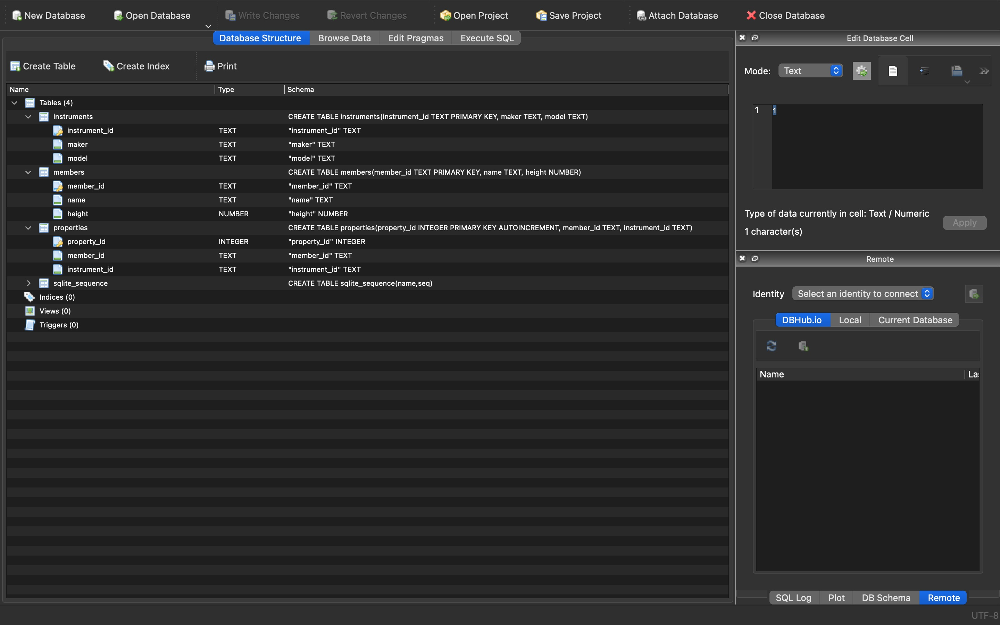

# SQL

## Notebook

=> [sqlite3_basics.ipynb](sqlite3_basics.ipynb)

## DBBrower for SQLite

## リンク

- [SQLite](https://www.sqlite.org/)
- [sqlite3 (python)](https://docs.python.org/3/library/sqlite3.html)
- [DB Browser for SQLite](https://sqlitebrowser.org/)
